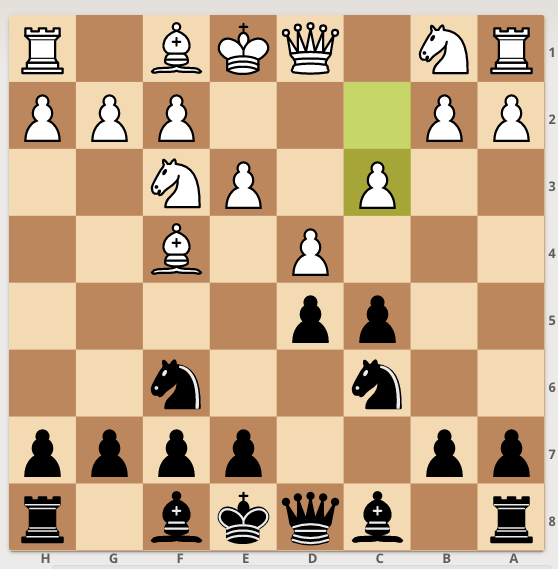
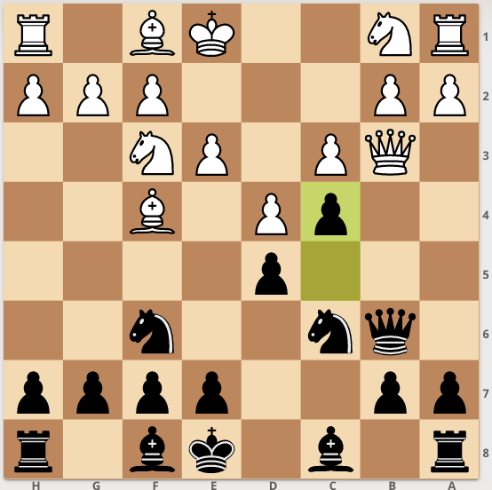
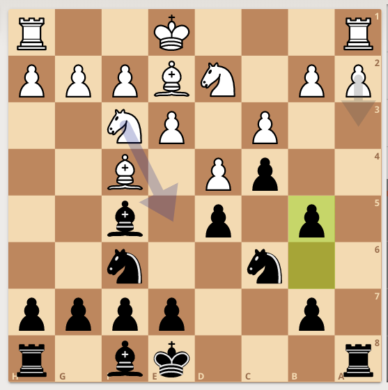
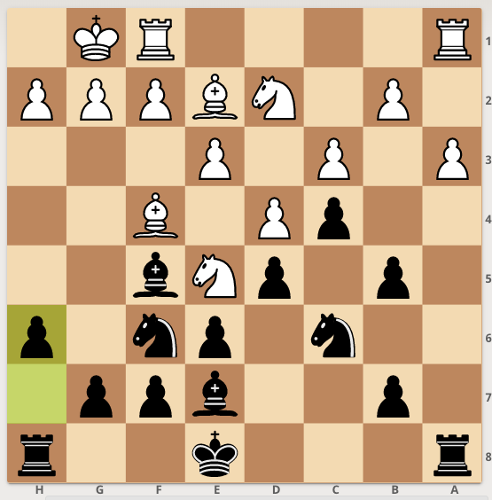
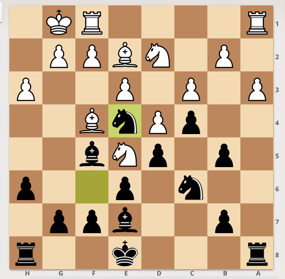
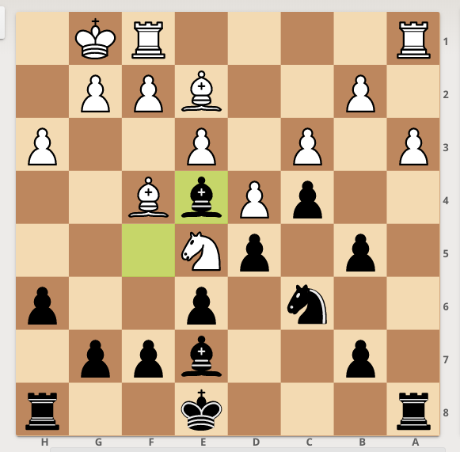
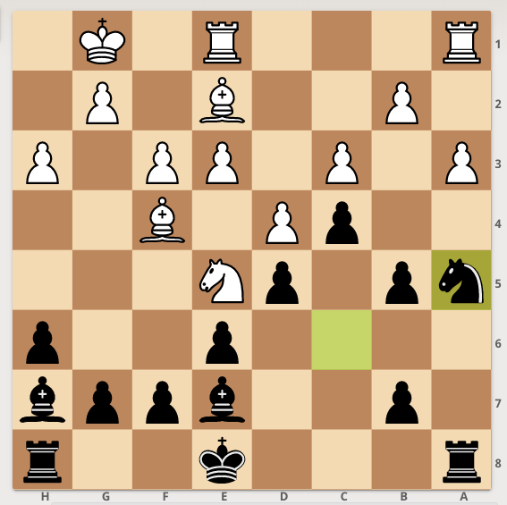

# Chess Blog

### d5 against the London
Play for d5, c5 to open up the Queen to go to b6

Qb3 is the most popular reply, but c4 gaining space, forcing a queen trade and opening up the rook on a8 is good

Important to play Bf5 and b5. Thee idea is to prompt a3 and then play Ne4 to remove the d2 defender of b3 and Na5

h6 is a useful move to threaten g5 where, Bg3 is met with h5 or Nc6, bxc6, Be5, 0-0 with Nd7 and h5

Ne4 forces the issue. If White plays Nf3, f3 traps the night.

With the exchange of the Nd2, Black can start pushing for Na4-b3

After a move like Re1, Black can execute their knight repositioning plan. White needs to find Bxc6, where even then Black has a nice edge because of their Queen side space with c5, swap on c5 to get the Bishop to c5, Ke7, Rd8, f6, g5

#chess #london
